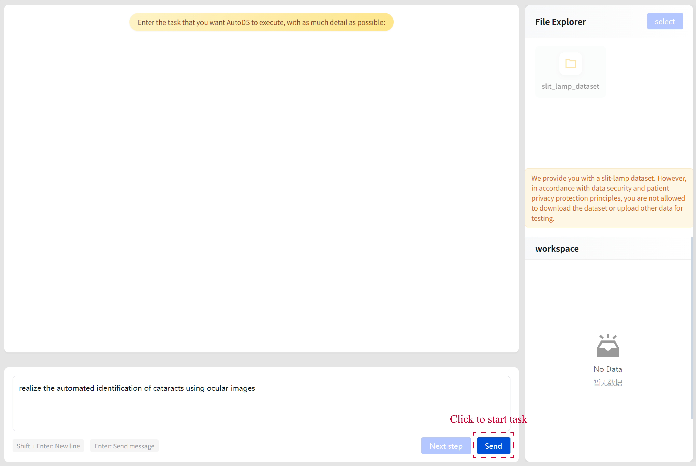
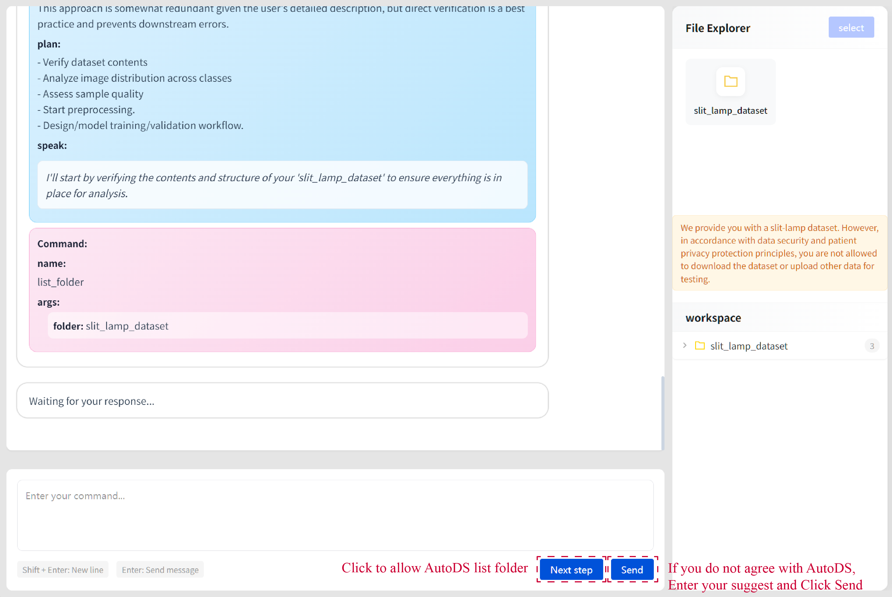
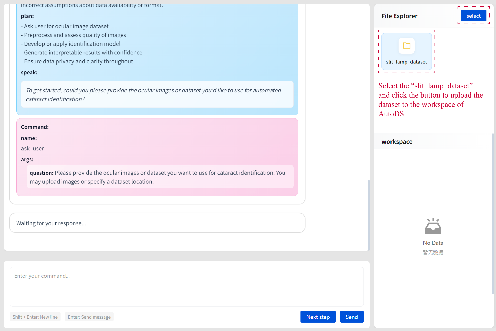
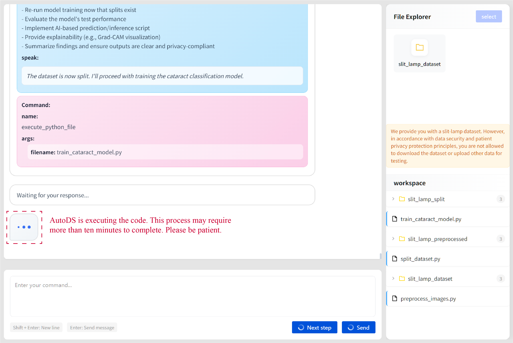
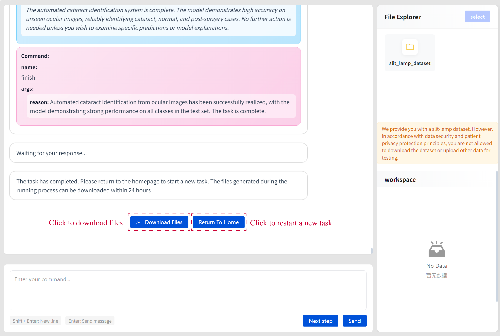

# AutoDS System

Welcome to **AutoDS System** — an intelligent, autonomous research agent for digital medical studies.

## 🩺 Introduction

AutoDS is an **LLM-driven research agent** that autonomously conducts digital medical research. It dynamically designs experiments, analyzes data, and refines strategies — all within a **secure computational sandbox**.

## ✨ Key Features

- **Autonomous Decision-Making & Dynamic Strategy**
  - Powered by an LLM-based decision-making module.
  - Dynamically formulates experimental strategies and executes research operations in real time based on objectives and contextual state.

- **Heuristic Iterative Framework**
  - Follows a cyclical **decision → execution → feedback → optimization** process.
  - Breaks down complex medical research tasks into executable subtasks.
  - Continuously improves solutions through self-evaluation.

- **Versatile Research Capabilities**
  - Supports:
    - **Fixed-goal research** (predefined objectives).
    - **Open-goal exploration** (discovery-driven research).
  - Covers experiment design, data processing, mining, and generating interpretable analytical outputs.

- **Secure Sandbox Environment**
  - All operations run within a dedicated digital medicine sandbox.
  - Ensures robust data security and reproducibility.

- **Transparency & Explainability**
  - Stepwise, iterative design clearly deconstructs decision logic.
  - Enables human oversight and intervention when necessary.

## 🚀 User Guide

1. This user interface system is intended for testing purpose, with the cataract identification task provided as a representative test case. Here is a test prompt: **realize the automated identification of cataracts using ocular images.** Enter the task in the command box and click the **“Send”** button to start the task.

2. AutoDS operates in a step-by-step manner. You can input suggestion and click the **"Send"** button, and AutoDS will continue to the next step of reasoning and execution based on your input. Alternatively, you can skip giving any feedback and simply click the **"Next Step"** button to proceed.

3. If you want to upload the dataset to the workspace of AutoDS, please select the **“slit_lamp_dataset”** folder. It’s recommended to input a brief description of the dataset to help AutoDS understand the basic information of the folder you upload. Here is a recommended prompt for you: **The dataset "slit_lamp_dataset" consisted of 3,064 slit-lamp photographs, including 776 images of normal lenses, 1,144 images of cataracts with varying severity and etiology, and 1,144 images of postoperative eyes. The images were organized into folders, with each filename containing the corresponding label.**

4. While AutoDS is training the model, please wait a few minutes before entering any commands or proceeding to the next step. Your patience is appreciated.

5. After the task is completed, Files generated by AutoDS during the task can be downloaded by clicking the **“Download Files”** button. (Files can’t be downloaded during the running process.)

#[Click here to start testing](http://47.115.222.218/)

## ⚠️ Notes

- If the system is idle for **30 minutes**, it will automatically shut down.
- **Do not refresh the page** — this will erase your conversation.
- In accordance with data security and patient privacy protection principles, it's not allowed to download the dataset or upload other data for testing.

## 🧠 Key Sections

AutoDS uses an internal structure for each cycle:

- **Thoughts**  
  The initial interpretation of a prompt or preliminary response to previous output.

- **Reasoning**  
  The justification behind each response.

- **Plan**  
  The execution steps toward achieving the goal.

- **Criticism**  
  Reflection on the current reasoning and decision-making.

- **Speak**  
  Information on the next action.

## 📂 Dataset Description

AutoDS ships with a sample dataset:

**Dataset:** `slit_lamp_dataset`  
**Size:** 3,064 slit-lamp photographs

**Classes:**

- **normal**
  - Images of healthy eyes without cataracts.
- **cataract**
  - Images of eyes affected by cataracts of varying severity and etiology.
- **post-surgery**
  - Post-operative images following cataract surgery.

> *Images are organized into folders, with filenames containing the corresponding label.*
